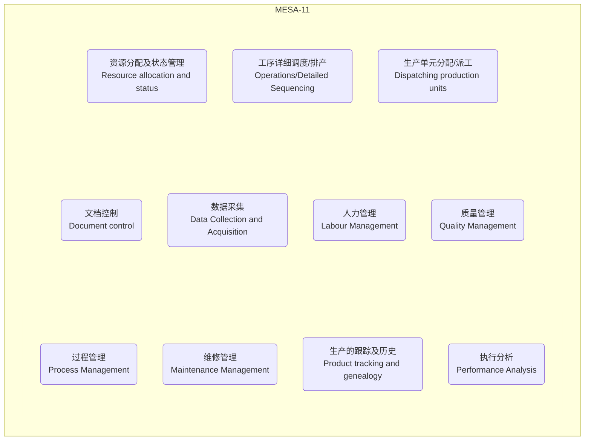
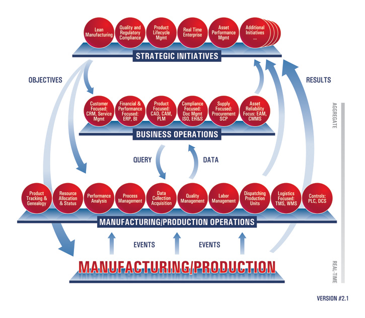
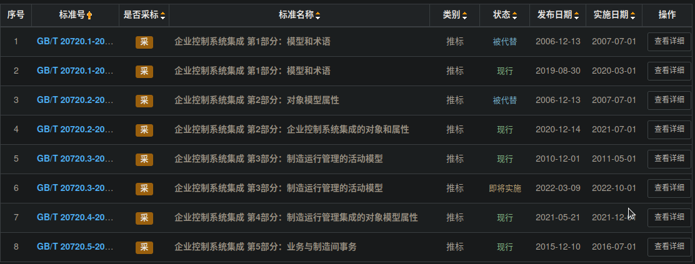
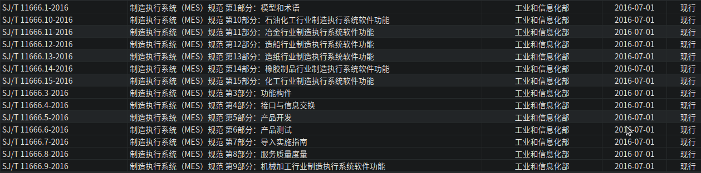
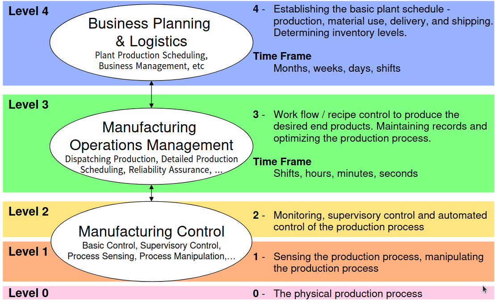

MES(Manufacturing Execution System) 于 90 年代初由美国 **AMR**(Advanced Manufacturing Research, Inc. 先进制造研究中心) 首次提出，该公司 1994 年成立，于 2001 年转让了，现在已经找不到了。然后 **MESA**(制造执行系统协会)、**ISA**(仪表、系统和自动化协会) 等组织和机构也相继提出了 MES 体系架构。

[MESA](https://mesa.org/) 于 1997 年提出了 MES 外部系统模型和 MES 功能模型，包含 11 个功能模块，该模型最为出名，为多数教材引用。

[ISA](https://www.isa.org/) 于 2000 年也提出了 [ISA-95](https://www.isa.org/standards-and-publications/isa-standards/isa-standards-committees/isa95) 标准，网上多说简称 SP95，其实 SP95 是该标准开发团队的代号。标准的制定过程更有 [ANSI](https://www.ansi.org/)(美国国家标准协会) 监督和背书，后来被合入 ISO(国际标准化组织)，编号 **IEC/ISO 62264**。该标准包含 4 类 9 大模型，2006 年开始陆续被翻译成中国国标 **GB/T 20720**，2016 年工信部也基于此翻译和汇编了 **SJ/T 11666** 作为电子行业标准。ISA-95 名称为 Enterprise-Control System Integration（企业控制系统集成），已经高于 MES，其实它是从 PRM 的 Purdue 模型、MESA 的模型、IEC61512-1 的层次模型中综合而来。

<!--truncate-->

## [MESA](https://mesa.org/)

MESA 不输出什么标准，作为一个研究机构，他只能输出白皮书，所以[官网](https://www.pathlms.com/mesa/searches) 上搜索 White Paper，可以查到它输出了 60+ 白皮书，每份白皮书大多在 20 页左右，都是售价 $50:

```
MESA White Paper #01: The Benefits of MES: A Report from the Field
MESA White Paper #02: MES Functionalities and MRP to MES Data Flow Possibilities
MESA White Paper #03: The Controls Layer: Controls Definition and MES to Controls Data Flow Possibilities
MESA White Paper #04: MES Software-Evaluation/Selection
MESA White Paper #05: Execution-Driven Manufacturing Management for Competitive Advantage
……
```

其中 `MESA White Paper #02` 定义了 MES 的 11 个 功能（functions），俗称 MESA-11。

### MESA-11



网上有很多翻译，我就直接摘录了：

1. **Resource allocation and status**（资源分配及状态管理）: 管理机床、工具、人员物料、其它设备以及其它生产实体.
2. Operations/Detailed Sequencing（工序详细调度、**排产**）: 提供生产单元相关的优先级（Priorities）、属性（Attributes）、特征（Chameterietioa）以及处方（Recipes）等；
3. **Dispatching production units**（生产单元分配、**派工**）: 以作业、订单、批量、成批和工作单等形式管理生产单元间的工作流。
4. Document control（文档控制）: 控制、管理并传递与生产单元有关工作指令、配方、工程图纸、标准工艺规程等。
5. **Data Collection and Acquisition**（数据采集）: 通过数据采集接口来获取并更新与生产管理功能相关的各种数据和参数。
6. **Labour Management**（人力管理）: 提供每个人的状态，包括时间对比，出勤报告，行为跟踪及行为（包含资财及工具准备作业），实现对人力资源的间接行为的跟踪能力。
7. **Quality Management**（质量管理）:
8. **Process Management**（过程管理）: 监控生产过程、自动纠正生产中的错误并向用户提供决策支持以提高生产效率。
9. Maintenance Management（维修管理）: 针对设备，工装夹具
10. **Product tracking and genealogy**（生产的跟踪及历史）: 对作业的位置、人员、供应商、关联序号、生产条件、警报状态、及再作业后跟生产联系的其他事项进行可视化。
11. **Performance Analysis**（执行分析）: 通过过去记录和预想结果的比较提供以分为单位报告实际的作业运行结果。

### C-MES

到了 2004 年，在老的模型基础上，又提出了旨在加强和其他系统、其他职能协同的 C-MES 模型。根据 MESA 的说法，C-MES 模型侧重于核心运营活动如何与业务运营相互作用，模型增加了外包、供应链优化、资产优化等内容。


上图即 C-MES 的框图，重点强调了 MES 与其他系统（CRM、ERP、CAD、WMS、PLC、SCP）的接口及交互。其中 11 个功能模块在这里变成 8 个，去掉的 3 个是：~~排产、文档管理、维修~~。

最后，在 2008 年，推出了 C-MES 的最新版本: Version 2.1，模型进一步扩展，从生产到工厂运营、业务运营、甚至到战略计划、精益制造、法规、产品声明周期管理、实时企业、资产绩效……标准就快变成成功学书籍了。



## ANSI(ISA-95)、ISO(IEC-62264)、GB/T(20720)

ISA-95 比 MES 更高一个维度的定义了生产制造，之所以命名为 Enterprise-Control System Integration（企业控制系统集成），意思就是把生产制造系统如何融入到企业中做一个完整的定义。在 Part 1 中有描述：

> 第 5 章描述了与制造组织有关联的功能层次和控制域的层次模型。这些模型是基于称为 PRM 的“Purdue 的 CIM 参考模型”,MESA 国际功能模型, 以及来自 IEC61512- 1 的设备层次模型。
> Purdue 的 CIM 模型参考：WILLIAMS A Reference Model for Computer Integrated Manufacturing(CIM)
> MES 模型参考 MESA 白皮书：MESA White Paper #02: MES Functionalities and MRP to MES Data Flow Possibilities

ISA95 当前包含 8 个文档，可在 [ANSI](https://ansi.org)和 [ISA](https://www.isa.org) 上查询到：

1. **ANSI/ISA-95.00.01-2000** "Enterprise-Control System Integration – **Part 1**: Models and Terminology"
2. **ANSI-ISA-95.00.02-2018** "Enterprise-Control System Integration – **Part 2**: Objects and Attributes for Enterprise-Control System"
3. **ANSI/ISA-95.00.03-2013** "Enterprise-Control System Integration – **Part 3**: Activity Models of Manufacturing Operations Management"
4. **ANSI/ISA-95.00.04-2018** "Enterprise-Control System Integration – **Part 4**: Objects and Attributes for Manufacturing Operations Management Integration"
5. **ANSI/ISA-95.00.05-2007** "Enterprise-Control System Integration – **Part 5**: Business to Manufacturing Transactions"
6. **ANSI/ISA-95.00.06-2014** "Enterprise-Control System Integration – **Part 6**: Messaging service model"
7. **ANSI/ISA-95.00.07-2017** "Enterprise-Control System Integration – **Part 7**: Alias Service Model"
8. **ANSI/ISA-95.00.08-2020** "Enterprise-Control System Integration – **Part 8**: Information Exchange Profiles"

- 1、2、3、5 发布的比较早，4、6 是 2010 年后发布的，比较晚；
- 2、4、5 在 2018 年统一修订和发布过；
- 7、8 是近几年新增的，baidu 基本看不到。

对应 IEC/ISO 62264 为以下文档：合入了 1~6，7、8 目前还没有合入。

1. **IEC 62264-1-2013** Enterprise-control system integration – **Part 1**: Models and terminology
2. **IEC 62264-2-2013** Enterprise-control system integration – **Part 2**: Objects and attributes for enterprise-control system integration
3. **IEC 62264-3-2016** Enterprise-control system integration – **Part 3**: Activity models of manufacturing operations management
4. **IEC 62264-4-2015** Enterprise-control system integration – **Part 4**: Object model attributes for manufacturing operations management integration
5. **IEC 62264-5-2016** Enterprise-control system integration – **Part 5**: Business to manufacturing transactions
6. **IEC 62264-6-2020** Enterprise-control system integration – **Part 6**: Messaging service model

IEC [官网](https://webstore.iec.ch) 可以下载这 6 份标准的预览版（仅有目录）。

我国 2006 年开始陆续翻译和修订为国标 GB/T 20720 系列，现行 5 个：



工信部则根据电子行业的特殊性，与其他标准合并，制定了 MES 相关的 15 个标准，其中前几个即从 ISA-95 和 GB/T 20720 而来。



### ISA-95 的分层



- Level0、1、2 是 MES 的执行层，包括：
  - 决策支持系统：用户测试界面、自动化测试设备、夹具、跟踪定位系统……
  - 控制系统：防错应用、产品的投产和跟踪……
  - 产品的生产及完成；
  - 发货和状态配置；
- Level3 是 MES 的操作和控制层，在 ISA 中又称为 MOM(Manufacturing Operations Management) 层，包括：数据的派发、编排，工作流的指定、可视化，可靠性的保证等。
- Level4 是业务规划层，属于 MES 针对管理层的范畴，与 ERP 也有重叠部分。

所以 ISA-95 高屋建瓴的定义了生产过程中所有的层级及接口，Level3、4，即业务规划、操作控制集中在**制造运营**，Level0、1、2 集中在**制造执行**。
