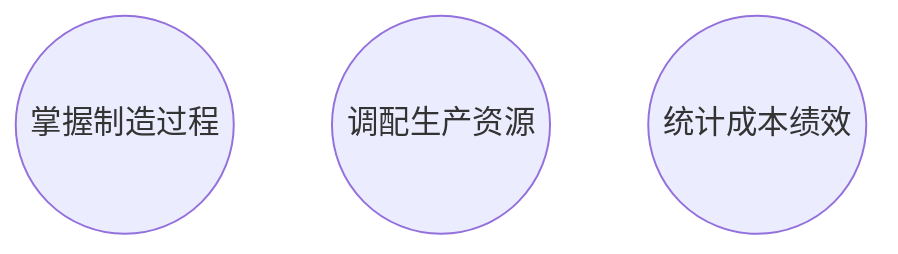
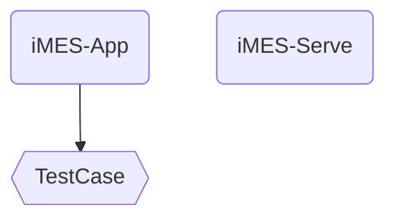

> MES 是针对企业整个生产制造过程进行管理和优化的集成运行系统。
>
> 它在接受订单开始到制成最终产品的全部时间范围内，采集各种数据信息和状态信息，与上层业务计划层和底层过程控制层进行信息交互，通过整个企业的信息流来支撑企业的信息集成，实现对工厂的全部生产过程进行优化管理。
>
> MES 提供实时收集生产过程数据的功能，当工厂发生实时事件时，MES 能够对此及时做出反应、报告，并使用当前的准确数据对其进行指导和处理。这种对事件的迅速响应使得 MES 能够减少企业内部无附加值的活动，有效指导工厂的生产运作过程，使其既能提高工厂及时交货能力、改善物料的流通性能，又能提高生产回报率。
>
> —— GB/T 25485-2010 工业自动化系统与集成制造执行系统功能体系结构

# iMES - 聚焦中小企业智能制造的 MES 系统

iMES: intelligent Manufacturing Execution System

大型企业都有自己的团队开发和维护 MES 系统，并且与公司内 ERP、OA 等系统对接，实现统一的生产制造工具流。iMES 则致力于为中小企业提供智能制造以及工业 4.0 所需的能力，包括：

- **掌握制造过程**: 产品、机型、工序、工站……皆可配置，并执行测试项、判断通知指标、进行工序管控，且为故障分析保存现场数据。
- **调配生产资源**: 生产过程可视化、实时预警、提升工站、测试设备和环境、测试人力的优化分配。
- **统计成本绩效**: 按需统计数据并生成报表，为质量和管理提供决策依据。

## iMES 组成

- **iMES-APP**
  - 一款跨平台的 APP，运行在用户的 Windows/Linux/macOS 测试主机或被测主体中，提供测试业务的配置、调度、排序、并发、日志等功能。
  - 挂载企业内部的生产测试用例：用户自己开发的测试功能（C++/C#/Python/RF）脚本可以与 iMES 通过简单的 API 连接。
- **iMES-Serve**
  - SaaS 服务，为 iMES-APP 提供数据、 管理、部署、集中监控等服务。

## iMES 系统的定位

**致力于解决中小企业 MES 的核心问题**:

- **周期短**：机型切换频繁、料单经常变化，希望一条产线上能够满足尽可能多类型产品的生产，产品间快速切换。
- **人力有限**：很难养一个完整的 MES 开发团队，只能在 ERP（企业资源管理）、WMS（仓库管理系统）、CRM（客户关系管理）的夹缝中开发中间件 or 扩展件，甚至有时需要 MES 能够替代部分 ERP、WMS、CRM 的功能，这样就不必使用多个系统，增加复杂度了。
- **预算紧张**：更多的资金要放在产品的研发和市场上，生产方面的研发投入优先级不及前者。
